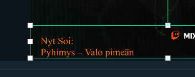
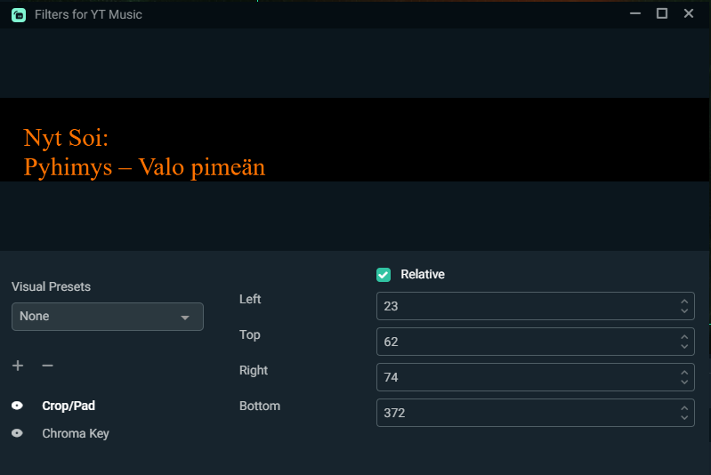
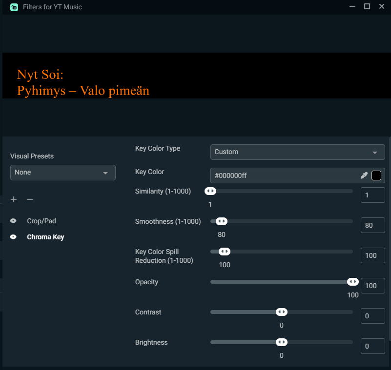

# Striimi-koodit

---

### YTMD-Musiikki-to-OBS.php    
Youtube Music Desktop ohjelmasta saadaan API:n kautta "nyt soiva" musiikki esim OBS Studioon.     
   
Hyödynnän YTMDesktop Remote Controlleria ja Raspberry PI / Linux konetta (jossa on Nginx/Apache, PHP8.1, PHP8.1-XML, PHP8.1-JSON, PHP8.1-CURL paketit) josta voi OBS:n Selaimella hakea sivun.     
     
HUOM! Tämä toimii Windowsissa myös. Mutta tarvitset sille [XAMPP ohjelmiston](https://www.apachefriends.org/index.html) jossa on PHP8.1, PHP8.1-XML, PHP8.1-JSON, PHP8.1-CURL-CURL paketit. 
    
    
Miltä näyttää OBS:ssä      
     
OBS Crop Filtteri asetukset:    
    
OBS Chroma Key asetukset:    
    

---

